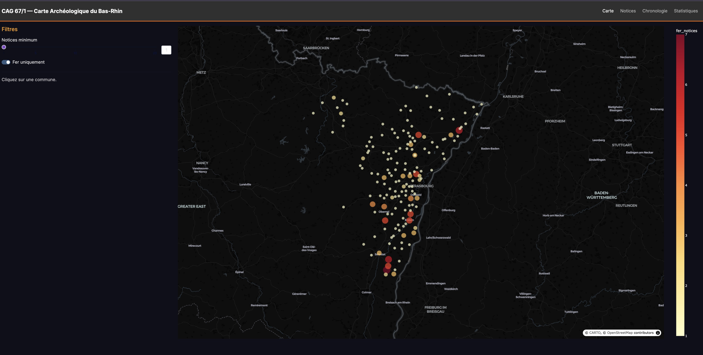
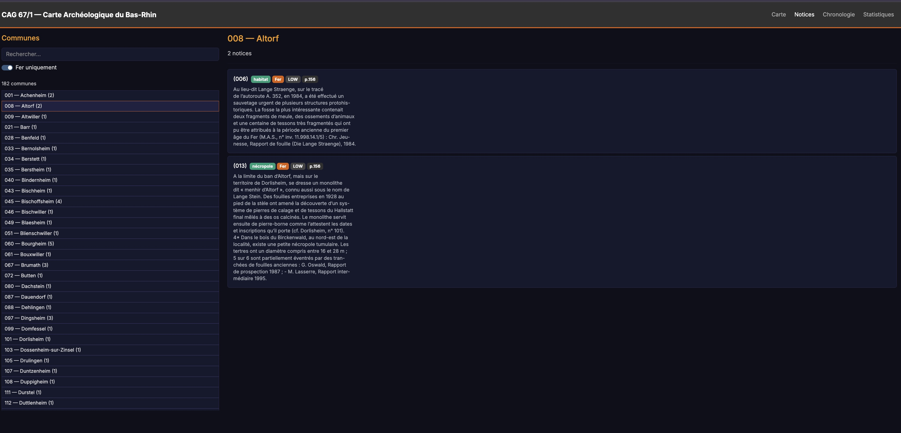
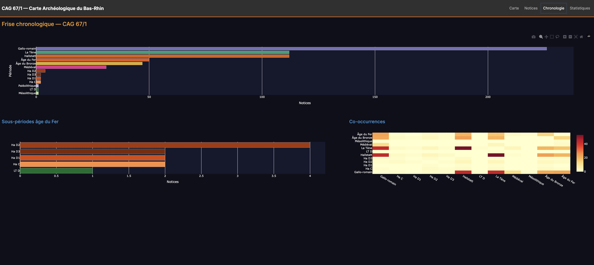
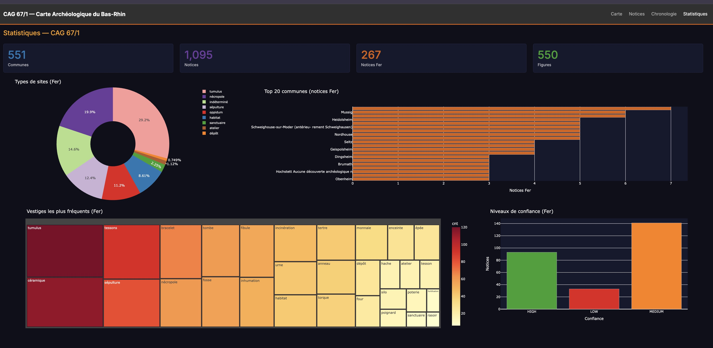

# CAG Bas-Rhin (67/1)

Extraction et visualisation interactive de la **Carte Archéologique de la Gaule — Le Bas-Rhin 67/1** (P. Flotté, M. Fuchs).

Pipeline d'extraction PDF → DuckDB → Dash UI pour explorer les 1 095 notices réparties sur 551 communes, avec un focus sur les **267 sites de l'âge du Fer** (Hallstatt / La Tène).

## Captures d'écran

### Carte interactive

Carte des communes du Bas-Rhin avec nombre de notices Fer (taille et couleur des points). Filtre par nombre minimum de notices et bascule Fer/toutes périodes.



### Navigateur de notices

Liste des 182 communes avec notices Fer, recherche textuelle, et affichage du texte intégral des notices avec tags (type, période, confiance, page).



### Frise chronologique

Distribution des périodes (toutes et sous-périodes Fer), avec heatmap de co-occurrences entre périodes sur les mêmes notices.



### Tableau de bord statistique

KPIs (551 communes, 1 095 notices, 267 Fer, 550 figures), donut des types de sites, top 20 communes, treemap des vestiges, et niveaux de confiance.



## Aperçu

```
CAG Bas-Rhin.pdf (735 pages, 209 Mo)
        │
        ▼
  ┌──────────────┐     ┌──────────────┐     ┌──────────────┐
  │  Extraction   │────▶│   DuckDB     │────▶│   Dash UI    │
  │  pdfplumber   │     │  6 tables    │     │  4 pages     │
  │  4 phases     │     │  5 vues      │     │  7 callbacks │
  └──────────────┘     └──────────────┘     └──────────────┘
         │                    │
         │                    ▼
         │            Géocodage BAN
         │            (centroïdes WGS84 + L93)
         │
         ▼
  Export → Pipeline BaseFerRhin
```

## Périmètre

| Propriété | Valeur |
|---|---|
| Source | CAG 67/1 — Le Bas-Rhin |
| Auteurs | Pascal Flotté, Matthieu Fuchs |
| Pages PDF | 735 (507 pages de notices, p.154–660) |
| Communes extraites | 551 |
| Notices totales | 1 095 |
| Notices âge du Fer | 267 |
| Figures référencées | 550 |
| Département | Bas-Rhin (67) |

## Installation

```bash
cd "sub_projet/CAG Bas-Rhin"
python -m venv .venv && source .venv/bin/activate
pip install -e ".[ui,dev]"
```

Prérequis système : Python >= 3.11. Le PDF est natif (pas besoin de Tesseract).

## Utilisation

### 1. Extraction (PDF → DuckDB)

```bash
python -m src extract --pdf "../../RawData/GrosFichiers - Béhague/CAG Bas-Rhin.pdf"
```

Produit `data/cag67.duckdb` avec 6 tables et 5 vues analytiques. Temps : ~90 secondes.

### 2. Géocodage des communes

```bash
python -m src geocode
```

Géocode les communes via l'API BAN (Base Adresse Nationale), avec cache GeoJSON et reprojection Lambert-93. Temps : ~30 secondes.

### 3. Interface web

```bash
python -m src.ui
# → http://localhost:8051
```

4 pages interactives :

| Page | Contenu |
|---|---|
| **Carte** | Communes sur carte MapLibre (carto-darkmatter), taille = nb notices Fer, filtres |
| **Notices** | Navigateur de texte par commune, recherche, tags type/période/confiance |
| **Chronologie** | Frise toutes périodes, zoom sous-périodes Fer, heatmap co-occurrences |
| **Statistiques** | KPIs, donut types, top 20 communes, treemap vestiges, barres confiance |

### 4. Statistiques CLI et EDA

```bash
python -m src stats       # KPIs et distributions
python -m src eda         # EDA détaillé (distributions, outliers, communes orphelines)
```

### 5. Export vers le pipeline parent BaseFerRhin

```bash
python -m src export --format raw-records --output ../../data/sources/cag67_records.json
python -m src export --all -o export/all_records.json   # toutes les notices
```

## Architecture

```
src/                            30 fichiers Python — 2 978 lignes
├── __main__.py                    CLI Click (6 commandes)
├── config.py                      Dataclasses de configuration (AppConfig)
├── extraction/                    6 fichiers — PDF → notices → records
│   ├── pdf_reader.py              Phase 1 : pdfplumber, extraction pages
│   ├── commune_splitter.py        Phase 2 : split en notices communales
│   ├── notice_parser.py           Phase 3 : sous-notices, lieux-dits, biblio
│   ├── iron_age_filter.py         Phase 4a : filtre âge du Fer (26 mots-clés)
│   ├── record_builder.py          Phase 4b : SiteRecord + classification
│   └── pipeline.py                Orchestrateur des 4 phases
├── storage/                       3 fichiers — DuckDB persistence
│   ├── schema.py                  6 tables + 5 vues SQL
│   ├── loader.py                  Insert records → DuckDB
│   └── queries.py                 11 requêtes analytiques + géocodage BAN
├── export/                        1 fichier
│   └── to_raw_records.py          Export JSON pour BaseFerRhin
└── ui/                            12 fichiers — Interface Dash
    ├── app.py                     Factory (DARKLY theme, 7 callbacks)
    ├── layout.py                  Layout principal
    ├── callbacks.py               (réservé, non utilisé)
    ├── pages/                     4 pages
    │   ├── carte.py               Carte MapLibre + filtres
    │   ├── notices.py             Navigateur communes/notices
    │   ├── chronologie.py         Frise + heatmap co-occurrences
    │   └── stats.py               Dashboard KPIs + charts
    └── components/                4 composants réutilisables
        ├── commune_map.py         Scatter map communes
        ├── notice_card.py         Carte notice avec highlight Fer
        ├── period_chart.py        Bar chart périodes
        └── type_chart.py          Donut types de sites

tests/                             6 fichiers — 45 tests
├── test_pdf_reader.py             6 tests — extraction texte
├── test_commune_splitter.py       6 tests — split communes
├── test_notice_parser.py          6 tests — sous-notices
├── test_iron_age_filter.py        11 tests — filtre Fer
├── test_record_builder.py         10 tests — classification
└── test_duckdb_storage.py         6 tests — schéma, vues
```

## Stack technique

| Composant | Version | Rôle |
|---|---|---|
| **Python** | >= 3.11 | Runtime |
| **pdfplumber** | >= 0.11 | Extraction texte PDF natif (2 colonnes) |
| **DuckDB** | >= 1.1 | Base analytique embarquée |
| **Dash** | >= 2.14 | Framework UI web |
| **dash-bootstrap-components** | >= 1.5 | Thème DARKLY + composants |
| **Plotly** | (via Dash) | Cartes MapLibre, charts |
| **pyproj** | >= 3.6 | Reprojection WGS84 ↔ Lambert-93 |
| **httpx** | >= 0.27 | Client HTTP pour API BAN |
| **Click** | >= 8.0 | CLI multi-commandes |
| **Rich** | >= 13.0 | Sortie console formatée |
| **PyYAML** | >= 6.0 | Configuration YAML |
| **pytest** | >= 8.0 | Tests unitaires |
| **Ruff** | >= 0.4 | Linter/formatter |

## Tests

```bash
pytest                    # 45 tests, 6 modules
pytest -v                 # détail par test
ruff check src/ tests/    # lint
```

## Documentation détaillée

| Document | Contenu |
|---|---|
| [ARCHITECTURE.md](docs/ARCHITECTURE.md) | Pipeline d'extraction, flux de données, callbacks UI |
| [DOMAIN.md](docs/DOMAIN.md) | Contexte archéologique, classificateurs, vocabulaire contrôlé |
| [DATABASE.md](docs/DATABASE.md) | Schéma DuckDB complet (6 tables, 5 vues) |
| [API.md](docs/API.md) | CLI, requêtes analytiques, géocodage, export |

## Licence

MIT
